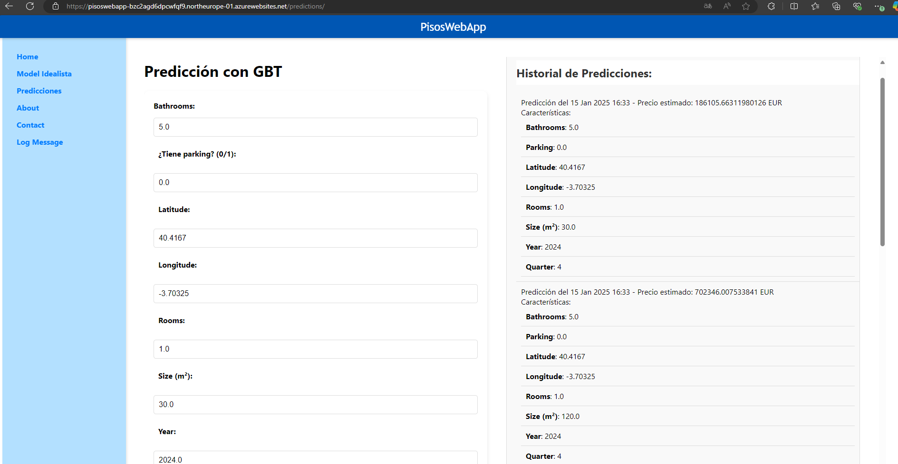

# AzurePisos

# Project Documentation

This project is part of the **TFM "Cloud Native application on Azure for visualizing Machine Learning applied to real estate data" of José Arturo Gómez Díaz**. The final model endpoint will be consumed from a **Django web application**.

## Table of Contents
1. [ConfigFolder](#configfolder)
2. [DATOS](#datos)
3. [ETLs](#etls)
4. [Models](#models)

## ConfigFolder
This folder contains the necessary classes and configuration files for connecting to Azure Storage using `SAS Token`. It also includes environment variables for container and folder names.

- **Connection Classes:** Handles authentication and interaction with Azure Storage.
- **venv_nb:** Stores environment variables for defining container and folder names.

## DATOS
This folder contains intermediate `.csv` files generated throughout the data processing pipeline. These files are stored for visualization and analysis purposes.

## ETLs
This folder contains a collection of notebooks used for:
- **Exploratory Data Analysis (EDA):** Initial data analysis to understand distributions, missing values, and correlations.
- **Data Processing Pipelines:** Transformations applied to raw data to prepare it for machine learning models.
- **Orchestration Pipeline:** Integration of the data processing steps into a structured workflow.

## Models
This folder contains the final notebook responsible for:
- Training multiple machine learning models.
- Evaluating and selecting the best-performing model.
- Deploying the selected model as an endpoint using Databricks Model Serving.

---
This project is structured to facilitate efficient data processing, analysis, and model deployment within the Databricks environment.